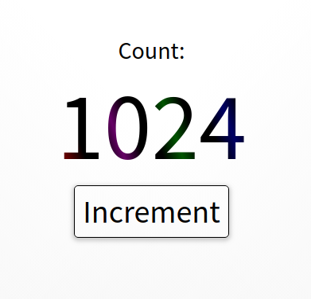

# Incrementor Website

This website was written using Node and Express as a project for Grio.


## How to run
```
git clone https://github.com/phantomfive/grio
cd grio
npm install
npm run dev
```

From there you should be able to visit http://localhost:8080/ in your browser. 

## To login

```
username: test
password: test
```


## Screenshots

Here are some samples of this amazing tool.



